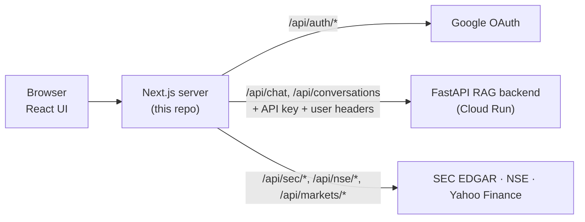

# LedgerMind — Financial Annual Report Chatbot (Frontend)

A Next.js financial research workspace for public companies in the United States and India. It has three parts:

- **Workspace chat**: ask questions about indexed annual reports and get cited excerpts back, with financial tables shown as tables.
- **US explorer**: live SEC EDGAR company search, XBRL financial facts and filings.
- **India explorer**: NSE company search, announcements, board calendar and annual reports.

Chat answers come from the companion backend, [Financial-chatbot-backend](https://github.com/itsmanojkumar/Financial-chatbot-backend), a FastAPI service that searches the indexed reports.

## How it fits together



The browser only calls this app's own `/api/*` routes. The Next.js server adds credentials and forwards requests, so no secrets or upstream URLs reach the browser and CORS is not needed.

## Quick start

```bash
npm install
npm run dev
```

Open [http://localhost:3000](http://localhost:3000) to pick a market, or go straight to [Workspace](http://localhost:3000/workspace) for chat, [United States](http://localhost:3000/us) or [India](http://localhost:3000/india).

For chat to work locally, run the backend too (it listens on port 8000 by default) and set `RAG_API_BASE_URL=http://localhost:8000`. To try the UI without a backend, set `NEXT_PUBLIC_USE_DEMO=true` for placeholder answers.

Production build:

```bash
npm run build
npm start
```

## Environment variables

Copy `.env.example` to `.env`. Put secrets in `.env.local`, which is git-ignored and overrides `.env`.

| Variable | Required | Purpose |
| --- | --- | --- |
| `RAG_API_BASE_URL` | Yes | Backend URL, for example `http://localhost:8000` or the Cloud Run URL |
| `RAG_API_KEY` | In production | Sent to the backend as `X-Backend-API-Key`. Must match the backend's `BACKEND_API_KEY`. Without it, chat returns 503 in production |
| `AUTH_SECRET` | Yes | Encrypts sign-in sessions. Generate with `openssl rand -base64 32` |
| `AUTH_GOOGLE_ID`, `AUTH_GOOGLE_SECRET` | For sign-in | Google OAuth web client credentials |
| `SEC_USER_AGENT` | For the US explorer | App name and a monitored email, as SEC requires, for example `LedgerMind contact: analyst@example.com` |
| `NEXT_PUBLIC_USE_DEMO` | No | `true` returns placeholder answers without calling the backend |
| `NEXT_PUBLIC_ALLOW_DIRECT_CHAT_API`, `NEXT_PUBLIC_API_URL` | No | Lets the browser call the backend directly. Leave unset unless the backend allows browser CORS |

Never prefix secrets with `NEXT_PUBLIC_`; those values are sent to the browser.

## Workspace chat

### What the answers contain

The backend searches four indexed annual reports:

| Report | Source |
| --- | --- |
| Microsoft FY2023 | Annual report (DOCX) |
| Microsoft FY2024 | Annual report (DOCX) |
| Microsoft FY2025 | Annual report (DOCX) |
| NVIDIA FY2026 | Annual report (PDF) |

Each answer is the five most relevant passages from those reports, with their sources. Financial tables arrive as Markdown and render as scrollable tables in the chat. Answers are retrieved excerpts, not text written by a language model.

Page numbers are available for NVIDIA. The Microsoft reports are Word files, which have no fixed pages, so their sources show the report but not a page.

### Saved conversations

Signed-in users' conversations are saved by the backend when it is connected to its database. The app lists, opens and deletes them through `/api/conversations`. Signed-out users' chats stay in the browser's local storage only.

### Backend API used by this app

The Next.js proxy forwards only these routes:

| Method | Route | Purpose |
| --- | --- | --- |
| `POST` | `/api/chat` | Ask a question and get the full answer |
| `POST` | `/api/chat/stream` | Same, streamed as newline-delimited JSON |
| `GET` | `/api/conversations` | List the signed-in user's conversations |
| `GET`, `DELETE` | `/api/conversations/{id}` | Open or delete one conversation |
| `GET` | `/api/account` | Signed-in user's plan and questions used this month |
| `POST` | `/api/payments/orders` | Create a Razorpay order for Pro |
| `POST` | `/api/payments/verify` | Verify the payment and upgrade to Pro |

Request body for `/api/chat`:

```json
{
  "message": "What was Microsoft's operating income in 2025?",
  "conversationId": "optional-conversation-id",
  "reportIds": ["microsoft-2025"]
}
```

`reportIds` is optional and limits the search to those reports: `microsoft-2023`, `microsoft-2024`, `microsoft-2025`, `nvidia-2026`.

Response:

```json
{
  "reply": "Markdown answer text…",
  "conversationId": "conversation-id",
  "sources": [
    {
      "id": "microsoft-2025:12:ab34cd56ef78",
      "title": "Microsoft Annual Report 2025",
      "reportId": "microsoft-2025",
      "company": "Microsoft",
      "reportYear": 2025,
      "page": null,
      "snippet": "Revenue, 2025 = $281,724…"
    }
  ]
}
```

The stream sends `{ "token": "…" }` lines, then a final `{ "done": true, "conversationId": "…", "conversationSaved": true, "sources": [...] }` line. `conversationSaved` is false when the user is signed out or saving failed. If streaming fails with a server error, the app falls back to `/api/chat`; a refused request (such as `402` for the free limit) is shown to the user instead.

The proxy adds these headers to every backend request:

- `X-Backend-API-Key`: the shared secret from `RAG_API_KEY`.
- `X-Client-IP`: the visitor's IP, so signed-out visitors are rate limited separately.
- `X-Auth-User-Id`, `X-Auth-User-Email`, `X-Auth-User-Name`: for signed-in users, so the backend can save conversations and track plans per user.

For backend errors in the 4xx range, the proxy passes the backend's message through as `{ "error": "…" }`; 5xx errors get a generic message.

## Google sign-in

1. In Google Cloud Console, create or open an OAuth 2.0 **Web application** client.
2. Add these **Authorized redirect URIs**:
   - `http://localhost:3000/api/auth/callback/google`
   - `https://<your-frontend-domain>/api/auth/callback/google`
3. Add the matching **Authorized JavaScript origins**: `http://localhost:3000` and `https://<your-frontend-domain>`.
4. Set `AUTH_GOOGLE_ID`, `AUTH_GOOGLE_SECRET` and `AUTH_SECRET`.

Sign-in uses Auth.js with encrypted JWT sessions, so it does not need a database.

## Pricing

Plans are shown in Indian rupees: Starter ₹0 (50 questions a month), Pro Analyst ₹2,499 a month, Team ₹8,499 per seat a month, and Enterprise on request. The displayed prices are set in `src/data/pricing.ts`; the amount actually charged comes from the backend's `PRO_PRICE_INR`, so keep the two in step.

- **Plans come from the backend.** For signed-in users the app reads the plan and this month's question count from `/api/account`. The backend refuses a free user's 51st question of the month, and the app then opens the pricing page.
- **Upgrading to Pro** requires signing in. "Upgrade to Pro" creates an order through `/api/payments/orders`, opens Razorpay Checkout, and sends the result to `/api/payments/verify`. Once the backend verifies the payment, the account shows Pro with its end date. Each payment buys 30 days.
- **Team and Enterprise** are not sold online; their buttons explain that.
- **Fallback:** signed-out users, or a backend without account storage, get the 50-question limit counted in the browser only.

## US explorer (SEC EDGAR)

Search by company name, ticker or CIK to see the company profile, annual XBRL facts (revenue, net income, operating cash flow, assets, equity, cash, debt and diluted EPS), recent 10-K, 10-Q, 8-K and proxy filings, and links to the original documents. You can also ask the workspace about the selected company.

SEC data is fetched by the server through `/api/sec/*`, because `data.sec.gov` does not allow browser requests. It needs no API key, but SEC asks for a `SEC_USER_AGENT` with a contact email. Verify material figures in the original filings.

The US market panel shows S&P 500, Nasdaq Composite, Dow Jones and Russell 2000 quotes from Yahoo Finance, refreshed about once a minute. These are delayed snapshots, not licensed real-time data, and no US earnings dates are shown because SEC publishes no central calendar.

## India explorer (NSE)

Company, index, board-calendar, announcement and annual-report data come from official NSE feeds through the server's `/api/nse/*` routes. The company list is cached for six hours and the announcements feed for five minutes. Annual-report PDFs open in the in-app reader; a report missing from NSE's feed is marked pending. Announcement, results and shareholding readers are still in progress.

The upcoming-results panel lists only future board meetings whose agenda mentions financial results. A board meeting date does not guarantee results are released that day.

LedgerMind is independent and is not endorsed by NSE or SEC.

## Deploy on Render

1. On [Render](https://dashboard.render.com), create a Blueprint from this repo. It uses `render.yaml` to run the Next.js Node server, which the API routes need; a static site will not work.
2. In the Render dashboard, set `RAG_API_KEY`, `AUTH_SECRET`, `AUTH_GOOGLE_ID`, `AUTH_GOOGLE_SECRET` and `SEC_USER_AGENT`. The blueprint already sets `RAG_API_BASE_URL` to the Cloud Run backend and `NEXT_PUBLIC_USE_DEMO=false`.
3. Add the Render domain's callback URL to the Google OAuth client (see [Google sign-in](#google-sign-in)).

## Stack

- Next.js 16 (App Router), React 19, TypeScript
- Auth.js v5 with Google
- Tailwind CSS with the typography plugin
- Framer Motion, lucide-react
- react-markdown with GitHub-flavored Markdown tables
